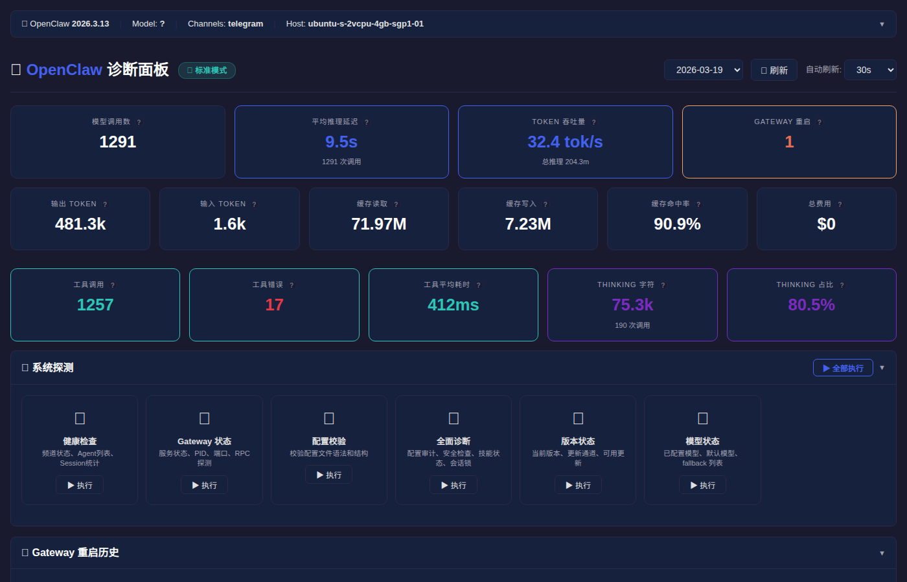
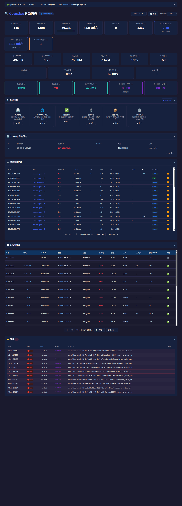

# OpenClaw Diagnostic Dashboard

A web-based performance diagnostic tool for the [OpenClaw](https://github.com/nicepkg/openclaw) AI agent platform. Zero external dependencies — pure Python standard library.

> **v3.2** — Multi-agent filtering support. New `-a/--agent` flag for per-agent diagnostics across batch, summary, and live follow modes. Critical bug fixes for date filtering accuracy and agent-scoped statistics.

## 📸 Screenshots

### Dashboard Overview — KPI & System Probes



*5 rows of KPI cards: core metrics (run count, inference ratio, token throughput), token details, message pipeline, and tool/thinking stats. System probe panel with 6 one-click diagnostics.*

### Standard Mode — Full Page


*Complete standard mode view: KPI overview → system probes → Gateway restart history → model call records → session browser → error tracking. Zero configuration needed.*

### Advanced Mode — Full Page



*Advanced mode adds run-level details, event timeline, and debug log analysis on top of all standard mode features.*

### CLI Mode

```
🦞 OpenClaw 诊断工具 v3.2.0
━━━━━━━━━━━━━━━━━━━━━━━━━━━━━━━━━━━━━━━━

🏥 健康检查 ... ✅ (9.9s)
  Agent: 7 个 (Coordinator, Developer, Designer, Researcher, QA, ...)
    main: 49 sessions | waicode: 8 sessions | waidesign: 4 sessions ...
  Session 总数: 49

🌐 Gateway 状态 ... ✅ (12.0s)
  PID: 806521 | 端口: 18789 (loopback) | 状态: active/running | RPC: ✅ 正常

✅ 配置校验 ... ✅ (4.3s)
  Config valid: ~/.openclaw/openclaw.json

🔬 全面诊断 ... ✅ (17.9s)
  ┌  OpenClaw doctor
  ◇  Startup optimization ──────────────────────────────────╮
  │  - NODE_COMPILE_CACHE is not set                        │
  │  - OPENCLAW_NO_RESPAWN is not set to 1                  │
  ├─────────────────────────────────────────────────────────╯
```

### Shell Script — Run Diagnostics

```
[OpenClaw 诊断报告]
日期: 2026-03-19

====================================================================
                             [摘要统计]
====================================================================
  Run 总数:        139
  工具调用总数:    1237
  工具调用:        1267 次 (失败 1, 成功率 100%)
  工具平均耗时:    876ms
  Top 工具:        exec(614), read(313), edit(195)

  推理延迟:    平均 9.4s  (基于 session 时间戳, 1304 次调用)
  Token 吞吐:  平均 32.4 tok/s  (基于 session 时间戳, 1295 次调用)

  Agent 活动分布:
    clawdoctor      推理  67次  平均     9.0s  吞吐 29.9 tok/s  会话 3
    main            推理 884次  平均     8.6s  吞吐 36.0 tok/s  会话 7
    waicode         推理 708次  平均     9.1s  吞吐 41.5 tok/s  会话 18
    waiqa           推理  25次  平均     8.5s  吞吐 49.6 tok/s  会话 1
    wairesearch     推理  23次  平均    15.6s  吞吐 47.6 tok/s  会话 1

  工具使用排行:
    exec     588次  平均耗时 1.5s
    read     311次  平均耗时 56ms
    edit     195次  平均耗时 38ms
    ...
```

## Features

### Web Dashboard (`openclaw-dashboard.py`)

**Core**
- **Zero Dependencies** — Python standard library only, no pip install
- **Standard / Advanced Mode** — Standard mode reads session files only (no debug config needed); `--advanced` unlocks log-based run events and message pipeline
- **Separated Frontend** — Backend API + static files (`static/` directory)
- **Dark Theme** — GitHub-dark inspired UI
- **Cross-Platform** — Linux, macOS, Windows; Python 3.6+

**KPI Cards (3 rows)**
- **Row 1: Core Metrics** — Model call count, avg inference latency, token throughput, cache hit ratio
- **Row 2: Token Details** — Input/output tokens, cache read/write, inference ratio
- **Row 3: Tool & Thinking** — Tool call count, tool errors, tool avg duration, thinking call ratio, avg thinking depth (chars)

**Session Data Analytics (v3.0)**
- **Inference Timing** — Per-call `inference_ms` and `tokens_per_sec` from session.jsonl timestamps (assistant timestamp − preceding user/tool timestamp)
- **Tool Execution Stats** — Per-tool call count, total/avg duration, success rate, error count; sourced from `toolResult.details` (exitCode, durationMs)
- **Thinking Depth** — Thinking call count, avg chars, thinking ratio per model call
- **Conversation Tree** — Message chain visualization (user → assistant → toolCall → toolResult), yield/resume markers, model switch points
- **System Events** — Multi-agent coordination events (`custom_message`), model snapshots
- **Model Switching** — Tracks `model-snapshot` entries for provider/model changes over time

**Gateway & Probes**
- **Gateway Restart History** — Detects SHUTDOWN/TRIGGER/STARTUP/CRASH events; KPI cards + collapsible detail table
- **Probe Panel** — 6 built-in probes with one-click execution and live status (blue pulse → green success / red failure)
- **Probe List**: health, gateway\_status, config\_validate, doctor, update\_status, models\_status

**Run Analysis (Advanced Mode)**
- **Run List** — Paginated table with timing, model, channel, status, inference latency, tok/s
- **Run Detail** — Expandable Gantt chart, inference segments, tool call arguments, token summary
- **Message Pipeline** — Visual pipeline: Queued → Enqueue → Dequeue → Run → Processed
- **Event Timeline** — Filterable paginated event log with category badges

**Performance**
- **TTL Caching** — 10s TTL cache on summary, runs, restarts, tool stats; API response from 3.5s → 30ms
- **Batch API** — Single `/api/dashboard` returns all data in one request
- **Gzip Compression** — Auto gzip for >1KB responses (72-76% reduction)
- **ETag Caching** — Static files support ETag + 304 Not Modified
- **Skeleton Loading** — Placeholder cards for instant perceived performance

**Other**
- **Session File Coverage** — Scans `*.jsonl`, `*.jsonl.reset.*`, `*.jsonl.deleted.*` across all agents (e.g., 309 sessions from 7 agents)
- **Auto Refresh** — 5s to 5min configurable intervals
- **Access Token** — Optional `--token` for basic access control
- **Graceful Errors** — Handles missing dirs, corrupt JSON, huge logs, port conflicts

### CLI Mode

Run probes directly from the terminal — no web server needed:

```bash
python3 openclaw-dashboard.py --cli                        # Run all 6 probes
python3 openclaw-dashboard.py --cli --probe health         # Single probe
python3 openclaw-dashboard.py --cli --probe gateway_status # Gateway status
python3 openclaw-dashboard.py --cli --json                 # JSON output
```

**Available probes:**

| Probe | Description | Timeout |
|-------|-------------|---------|
| `health` | Agent list, session counts, channel status | 30s |
| `gateway_status` | PID, port, bind mode, service state, RPC check | 30s |
| `config_validate` | Configuration file syntax and structure | 15s |
| `doctor` | Full audit: security, skills, plugins, session locks, memory | 30s |
| `update_status` | Installed version, update channel, available updates | 20s |
| `models_status` | Default model, fallbacks, auth status, configured models | 20s |

### Shell Script (`openclaw-diag.sh` v3.2)

- **Multi-Agent Filtering** — `-a/--agent NAME` filters all stats by agent (e.g., main, waicode, wairesearch, waiqa)
- **Agent Activity Distribution** — Summary includes per-agent inference count, avg latency, token throughput, and session count
- **Session-Based Inference** — Per-call `inference_ms` and `tokens_per_sec` from session.jsonl (aligned with Python dashboard)
- **Tool Execution Details** — Extracts `toolResult.details` (exitCode, durationMs, stderr summary)
- **Tool Success Rate** — Per-tool success/failure stats
- **Error List** — Up to 20 entries, no character truncation, time-sorted
- **Terminal Diagnostic** — Colored output with run timelines
- **Live Follow Mode** — Real-time log streaming (`-f`)
- **Summary Mode** — Quick stats overview (`-s`)
- **Token Tracking** — Per-inference token usage breakdown
- **Duration Breakdown** — Visual bar charts for inference vs. tool time

## Prerequisites

### Standard Mode (default)

No configuration changes needed. Reads session files (`~/.openclaw/agents/*/sessions/*.jsonl`) for:
- Inference timing (per-call ms and tok/s)
- Token usage (input, output, cache)
- Tool execution stats
- Thinking depth analysis
- Model call details

### Advanced Mode (`--advanced`)

Adds log-based run events, message pipeline, and event timeline:

```json
// ~/.openclaw/openclaw.json
{
  "diagnostics": {
    "enabled": true
  },
  "logging": {
    "level": "debug"
  }
}
```

Then restart: `openclaw gateway restart`

## Quick Start

### Web Dashboard

```bash
python3 openclaw-dashboard.py               # Standard mode (port 9090)
python3 openclaw-dashboard.py --advanced     # Advanced mode
python3 openclaw-dashboard.py --port 8080    # Custom port
# Open http://127.0.0.1:9090
```

### CLI Probes

```bash
python3 openclaw-dashboard.py --cli          # All probes, human-readable
python3 openclaw-dashboard.py --cli --json   # All probes, JSON output
python3 openclaw-dashboard.py --cli --probe doctor  # Single probe
```

### Shell Script

```bash
./openclaw-diag.sh              # Today's runs
./openclaw-diag.sh 2026-03-11   # Specific date
./openclaw-diag.sh -f           # Live follow mode
./openclaw-diag.sh -l 5         # Last 5 runs
./openclaw-diag.sh -s           # Summary only
./openclaw-diag.sh -a waicode 2026-03-19    # Filter by agent
./openclaw-diag.sh -s -a main               # Summary for specific agent
./openclaw-diag.sh -f -a waicode            # Live follow specific agent
```

## Command Line Options

| Option | Default | Description |
|--------|---------|-------------|
| `--port PORT` | `9090` | Listen port |
| `--host HOST` | `0.0.0.0` | Bind address |
| `--log-dir DIR` | auto-detect | Log directory |
| `--sessions-dir DIR` | auto-detect | Session files directory |
| `--token TOKEN` | *(none)* | Access token |
| `--no-browser` | `false` | Don't auto-open browser |
| `--advanced` | `false` | Enable advanced diagnostics (requires debug logs) |
| `--cli` | `false` | CLI mode (no web server) |
| `--probe NAME` | `all` | CLI: specific probe (`health`, `gateway_status`, `config_validate`, `doctor`, `update_status`, `models_status`, `all`) |
| `--json` | `false` | CLI: JSON output format |

### Auto-Detection Order

**Log directory:** `--log-dir` → `$OPENCLAW_LOG_DIR` → `/tmp/openclaw/` → `~/Library/Logs/openclaw/` → `%TEMP%/openclaw/`

**Session directory:** `--sessions-dir` → `$OPENCLAW_SESSIONS_DIR` → `~/.openclaw/agents/*/sessions/` → `$OPENCLAW_STATE_DIR/agents/*/sessions/`

## API Reference

### Standard Mode Endpoints

| Endpoint | Description |
|----------|-------------|
| `GET /` | Dashboard page |
| `GET /api/dashboard?date=` | **Batch**: summary + model\_calls + restarts (+ events/runs/errors in advanced) |
| `GET /api/dates` | Available log dates |
| `GET /api/summary?date=` | KPI stats: model calls, inference timing, tokens, cache, tools, thinking |
| `GET /api/model_calls?date=&page=&per_page=` | Paginated model call records from session files |
| `GET /api/tool_stats?date=` | Per-tool call count, duration, success rate |
| `GET /api/restarts?date=` | Gateway restart history |
| `GET /api/system_info` | Python version, memory, config path, total model calls |
| `GET /api/mode` | Current mode (standard/advanced), data source availability |
| `GET /api/probes` | List available probes |
| `POST /api/probe/<name>` | Execute a single probe |
| `POST /api/probe/all` | Execute all probes |

### Advanced Mode Endpoints (additional)

| Endpoint | Description |
|----------|-------------|
| `GET /api/events?date=` | Event summary + message pipeline stats |
| `GET /api/events/timeline?date=&page=&per_page=&category=` | Paginated event timeline with category filter |
| `GET /api/events/webhooks?date=` | Webhook events |
| `GET /api/events/messages?date=` | Message queue events |
| `GET /api/events/errors?date=&severity=&type=` | Error list with filtering |
| `GET /api/runs?date=&page=&per_page=` | Paginated run list |
| `GET /api/run/<id>?date=` | Run detail: model\_calls, gantt, tools, inference segments |

All endpoints support `date` parameter (defaults to latest available date). Responses: `Content-Type: application/json; charset=utf-8`, gzip supported.

## Architecture

### Data Sources

| Source | Used In | Data |
|--------|---------|------|
| **Session files** `~/.openclaw/agents/*/sessions/*.jsonl` | Standard + Advanced | Model calls, tokens, inference timing, tool details, thinking, conversation tree |
| **Log files** `/tmp/openclaw/openclaw-YYYY-MM-DD.log` | Advanced only | Run events, message pipeline, event timeline |
| **OpenClaw CLI** | Both modes | Live probes (health, doctor, gateway status, etc.) |

Session file scanning covers: `*.jsonl`, `*.jsonl.reset.*`, `*.jsonl.deleted.*` across all agent directories.

### Inference Timing (Session-Based)

```
user message (timestamp T1)
    ↓
assistant response (timestamp T2)
    ↓
inference_ms = T2 - T1
tokens_per_sec = output_tokens / (inference_ms / 1000)
```

- Extracts timestamps from consecutive message pairs in session.jsonl
- Works in standard mode — no debug logs required
- Precise to individual LLM calls (not run-level estimates)

### Gateway Restart Detection

Identifies 4 event types from log files:
- **SHUTDOWN** — Graceful SIGTERM-initiated shutdown
- **TRIGGER** — External restart trigger (e.g., `openclaw gateway restart`)
- **STARTUP** — Gateway start event
- **CRASH** — Unexpected termination (no preceding SIGTERM)

### Performance

| Optimization | Effect |
|-------------|--------|
| TTL cache (10s) | summary/runs/restarts/tool\_stats: 3.5s → 30ms |
| Batch API | 3 HTTP requests → 1 |
| Gzip | app.js 28KB→8KB, API ~76% smaller |
| ETag + 304 | Static file cache validation |
| Critical CSS inline | Faster first paint |
| Session preload | Background thread loads session data on startup |

**Benchmarks (2 vCPU, 4GB RAM, 309 sessions, 963 model calls):**

| Metric | Result |
|--------|--------|
| All 15 endpoints < 500ms (cached) | ✅ |
| `/api/dashboard` (cached) | ~30ms |
| 10x concurrent dashboard | avg 350ms |
| Full page load (parallel) | ~1s |

## Compatibility

- **Python**: 3.6+
- **OS**: Linux, macOS, Windows
- **Browser**: Chrome, Firefox, Safari, Edge

## File Structure

```
openclaw-diag-dashbaard/
├── openclaw-dashboard.py   # Web dashboard + CLI (3900+ lines)
├── openclaw-diag.sh        # Shell diagnostic script v3.2 (1100+ lines)
├── gateway-restarts.sh     # Standalone restart detection
├── static/
│   ├── index.html          # Dashboard layout
│   ├── app.js              # Frontend logic (1400+ lines)
│   └── style.css           # Dark theme styles
├── docs/
│   └── screenshots/        # Dashboard screenshots
├── README.md               # English documentation
└── README_zh.md            # 中文文档
```

## Changelog

### v3.2 (2026-03-20)

**New Features**
- **Multi-Agent Filtering** (`-a/--agent NAME`) — Filter diagnostics by agent name (main, waicode, wairesearch, waiqa, etc.)
  - Batch analysis: filters runs, sessions, errors, and messages via session_uuid→agent mapping
  - Live follow mode (`-f`): filters event stream by agent
  - Summary mode (`-s`): scoped stats for a single agent
- **Agent Activity Distribution** — Summary now includes per-agent breakdown: inference count, avg latency, token throughput, session count

**Bug Fixes**
- **[P1]** Fixed date filter using ±1 day loose matching, causing ~35% stats inflation. Now uses strict UTC date matching
- **[P2]** Fixed agent filter not covering error/message statistics
- **[P3]** Fixed virtual Run mode not applying date filter to global statistics

### v3.0

- Session-first architecture — all analytics driven by `session.jsonl`
- Tool execution stats from `toolResult.details`
- Thinking depth analysis
- No debug log configuration needed for standard mode

## License

[MIT](LICENSE) © 2026 wujiaming88
